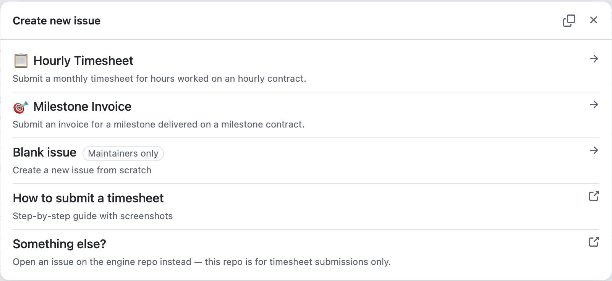
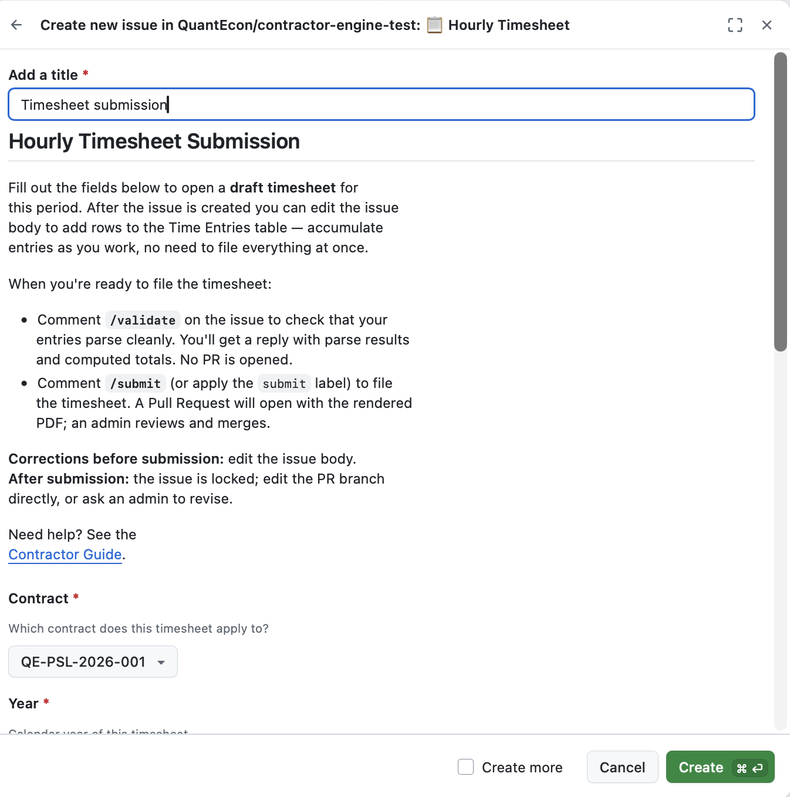
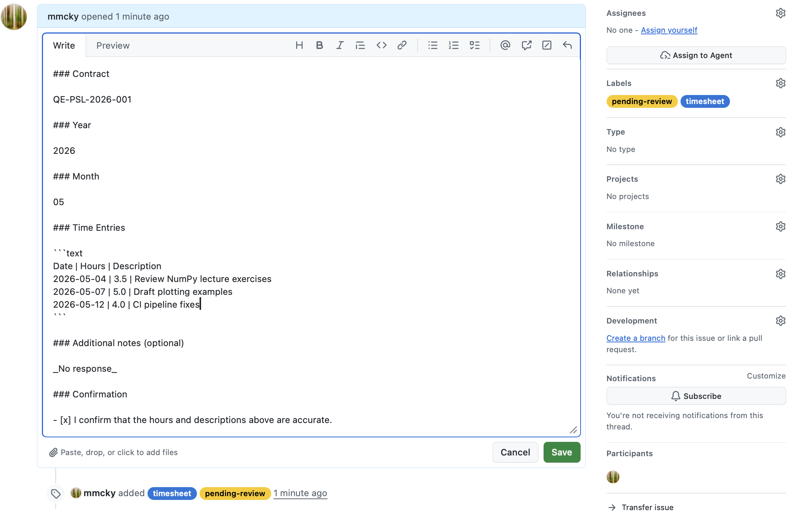
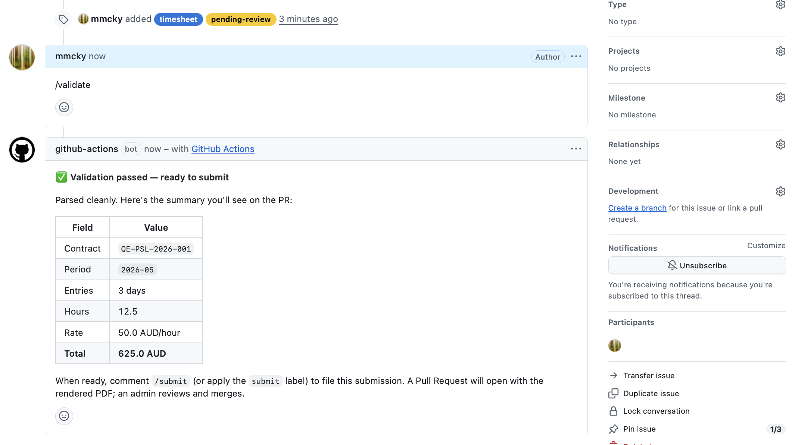
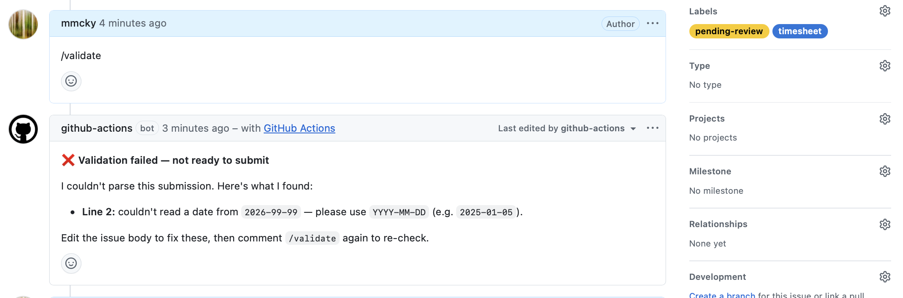
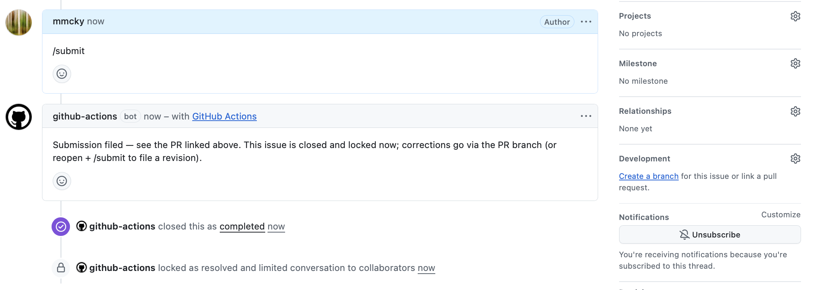
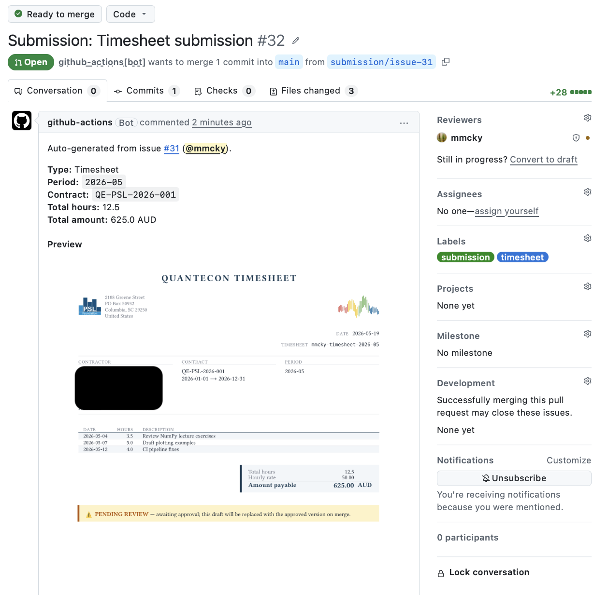

# Submitting a timesheet

This walks through filing a monthly timesheet on an hourly contract — from
opening a draft, through accumulating entries as you work, to filing the
submission for review.

The whole flow happens inside your contractor repo. Two GitHub primitives
do all the work:

- An **Issue** holds your timesheet while you fill it in. You can edit it
  over days or weeks.
- A **Pull Request** is created automatically when you submit. Your
  QuantEcon administrator reviews and merges it; that's when payment
  processing begins.

## 1. Open a draft

Go to your contractor repo's **Issues** tab and click **New Issue**. Pick
the **📋 Hourly Timesheet** template.



Fill in the three dropdowns and the confirmation checkbox:

- **Contract** — pick the contract this timesheet applies to. The list
  shows only your active contracts.
- **Year** + **Month** — the period this timesheet covers.
- **Time Entries** — leave the seeded `Date | Hours | Description` table
  as-is for now. You'll add your real rows once the issue exists.
- **Confirmation** — tick the box.

Click **Submit new issue**.



!!! info "Nothing is filed yet"
    Creating the issue does **not** create a PR. The issue is a
    *draft* — yours to edit until you're ready to submit.

## 2. Add entries as you work

Open the issue you just created. Click the **⋯** menu in the top-right of
the issue body → **Edit**. The body is a code block under
`### Time Entries` — that's where you add rows.

Each row goes on its own line in the format:

```text
YYYY-MM-DD | hours | description
```

For example, after a few days of work the entries table might look like:

```text
Date | Hours | Description
2026-05-04 | 3.5 | Review NumPy lecture exercises
2026-05-07 | 5.0 | Draft plotting examples
2026-05-12 | 4.0 | CI pipeline fixes
```



Things to know:

- **Keep the header row** (`Date | Hours | Description`). The parser uses
  it to recognise the entries table.
- **Hours can be fractional** (`3.5`, `0.25`). The unit is hours, not
  minutes.
- **Descriptions can contain anything**, including pipes. The parser
  splits each row on the first two `|` only — everything after the
  second pipe is the description.
- **One row per day**. If you worked multiple sessions in one day, sum
  them on a single row and describe both in the description.

Save the issue (the green **Update comment** button) any time you've
added a batch of entries. You can come back and edit again as many times
as you like.

## 3. Check your work with `/validate`

Before filing, run a pre-flight check. Post a comment on the issue with
just:

```text
/validate
```

After a few seconds, a bot reply appears with the parse result.

**On success** you'll see a green-check confirmation with computed
totals:



The totals are calculated using your contract's rate and currency, so
they're exactly what will appear on the rendered PDF.

**On failure** you'll see a red-X reply pointing at specific lines:



Common issues:

| What you see | What it means | Fix |
|---|---|---|
| `Line N: couldn't read a date from 'X'` | Date isn't in `YYYY-MM-DD` form | Reformat the date |
| `Line N: date 'X' is outside the selected period 'YYYY-MM'` | Day doesn't match the Year/Month dropdowns | Either change the date or change the period |
| `Line N: duplicate date 'X'` | Two rows share a date | Merge them into one row |
| `Time Entries section is empty` | No rows, or only the header row | Add at least one data row |

Fix the issue, save, and run `/validate` again. The bot updates the same
comment in place — no spam.

!!! tip "Re-validate as often as you like"
    `/validate` doesn't file anything. Use it whenever you're unsure
    whether a row will parse cleanly.

## 4. Submit

When validation passes and you're ready to file, post:

```text
/submit
```

Or, equivalently, apply the **`submit`** label to the issue from the
right-hand sidebar.



Within ~30 seconds:

1. A **Pull Request** opens in your repo. It contains the structured
   YAML of your submission, a rendered PDF, and an inline PNG preview.
2. Your QuantEcon administrator is **automatically requested as
   reviewer** (via CODEOWNERS).
3. The originating issue is **closed and locked**, with a comment
   linking to the PR.

You don't need to do anything with the PR — your administrator handles
review and merging.



## 5. After submission

Once your administrator merges the PR:

- The PDF is re-rendered with approval metadata (your administrator's
  name and the approval date).
- Your contract's **running ledger issue** is updated to reflect the
  approved timesheet.
- A confirmation email is sent to the QuantEcon payment processor.
- You receive a notification on the original issue confirming the
  approval.

You don't need to take any further action. Payment processing happens
outside GitHub on the fiscal host's normal cycle (typically 1–4 weeks).

## Reminders if you forget to file

On the first of each month, an automated reminder posts on any open
draft whose period has ended. If you started a draft for April and
haven't submitted by the time May begins, you'll see something like:

> 🔔 **Reminder — period `2026-04` has ended**
>
> This timesheet hasn't been submitted yet. When you're ready: comment
> `/validate` to check your entries, then `/submit` to file the
> timesheet. If you have nothing to file for `2026-04`, you can close
> this issue.

The reminder fires at most once per (issue, period). You won't be
double-pinged.

## Corrections and revisions

- **Before you submit** — just edit the issue body. Re-run `/validate`
  whenever you want.
- **After you submit, before the PR merges** — your administrator can
  request changes via standard PR review.
- **After the PR merges, before payment** — the issue can be reopened
  and `/submit`ted again to file a *revision*. The original PDF is kept
  as the audit trail; the new one supersedes it on the ledger. See
  [Corrections and revisions](corrections.md) for the details.

## When something goes wrong

If a `/submit` fails validation, the engine posts a parse-error comment
on the issue (using the same format as `/validate`) and labels the
issue `parse-error`. No PR is created. Fix the body, then either:

- Comment `/submit` again, or
- Re-apply the `submit` label (the previous one was auto-removed so
  re-applying re-triggers).

If anything else looks wrong — the bot doesn't respond, the PR doesn't
open, the PDF looks off — contact your QuantEcon administrator. The
issue stays in place as the record of what you tried to file.
